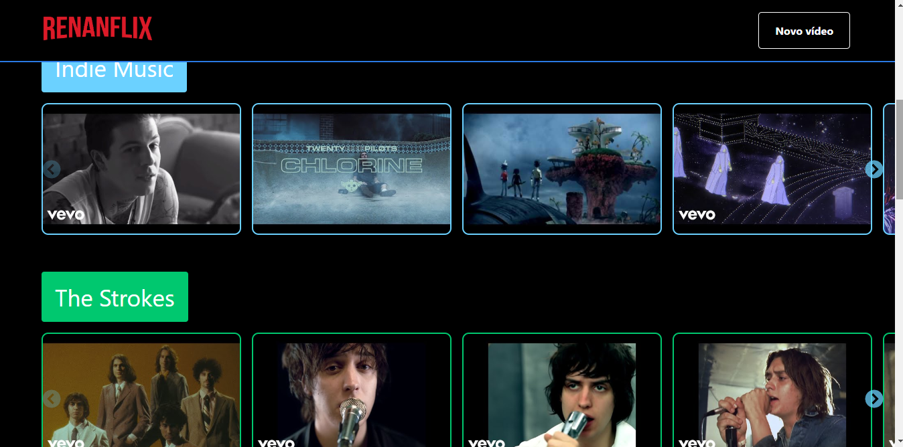
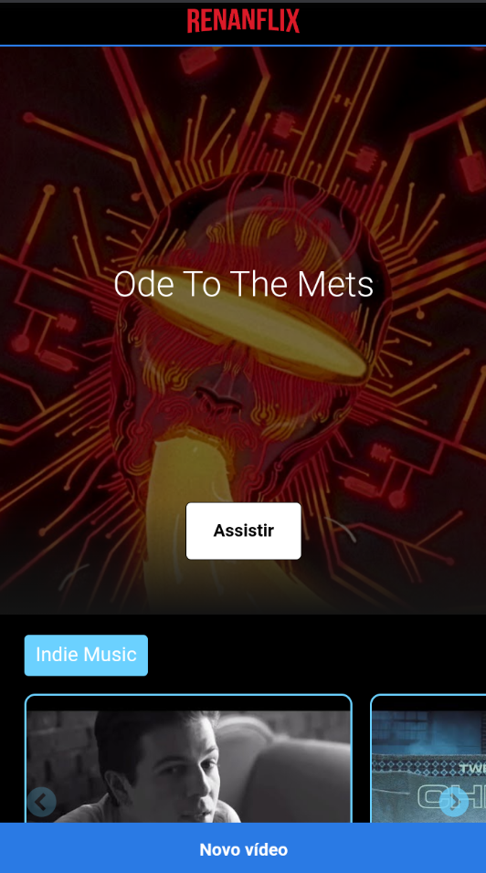

# Renanflix
Uma SPA (Single Page Application) baseada na Netflix com indicações de música, projeto resultado da Imersão React da Alura.

## Link para ver o resultado do projeto:
[RenanFlix](https://renanflix.netlify.app/)

## Bibliotecas utilizadas
* React
* React Hooks
* react-router-dom
* styled-components
* prop-types
* react-slicker
* json-server

### Screenshots

